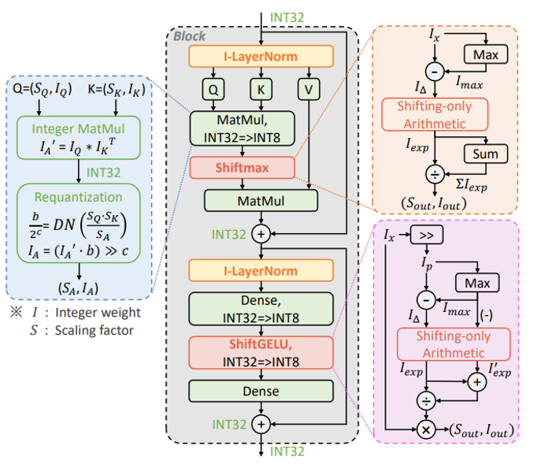

<div align=center>
  
  </div>

# I-ViT: Integer-only Quantization for Efficient Vision Transformer Inference

This repository contains the official implementation for the paper
*["I-ViT: Integer-only Quantization for Efficient Vision Transformer Inference"](https://arxiv.org/abs/2207.01405).*  To the best of our knowledge, this is the first work on integer-only quantization for vision transformers. 

Below are instructions of Pytorch code to reproduce the accuracy results of quantization-aware training (QAT). [**TVM benchmark**](https://github.com/zkkli/I-ViT/tree/main/TVM_benchmark)
is the TVM deployment project for reproducing latency results.

## Installation
- TVM version is recommended to be 0.9.dev0.
- Timm version is recommended to be 0.4.12.
- **To install I-ViT** and develop locally:

```bash
cd I-ViT
```

## QAT Experiments

- You can quantize and fine-tune a single model using the following command:

```bash
python quant_train.py [--model] [--data] [--epochs] [--lr]

optional arguments:
--model: Model architecture, the choises can be: 
         deit_tiny, deit_small, deit_base, swin_tiny, swin_small, swin_base.
--data: Path to ImageNet dataset.
--epochs: recommended values are: [30, 60, 90], default=90.
--lr: recommended values are: [2e-7, 5e-7, 1e-6, 2e-6], default=1e-6.
```

- Example: Quantize and fine-tune DeiT-T:


```bash
python quant_train.py --model deit_tiny --data <YOUR_DATA_DIR> --epochs 30 --lr 5e-7 
```

- To use the origin I-VIT paper IntLayerNorm and IntGELU
Please change the following code in models/vit_quant.py
   - For IntGELU please change the act_layer 
      ```python
      # line 214
                Block(
                    dim=embed_dim,
                    num_heads=num_heads,
                    mlp_ratio=mlp_ratio,
                    qkv_bias=qkv_bias,
                    qk_scale=qk_scale,
                    drop=drop_rate,
                    attn_drop=attn_drop_rate,
                    drop_path=dpr[i],
                    act_layer=IntGELU_HWF,   # <--- please change here
                    # act_layer=IntGELU,     # <--- please change here
                    norm_layer=norm_layer
                )
      ```
   - For IntLayerNorm please change the 
      ```
      # line 299
      def deit_tiny_patch16_224(pretrained=False, **kwargs):
         model = VisionTransformer(
            patch_size=16,
            embed_dim=192,
            depth=12,
            num_heads=3,
            mlp_ratio=4,
            qkv_bias=True,
            norm_layer=partial(IntLayerNorm_LUT, eps=1e-6), # change here
            # norm_layer=partial(IntLayerNorm, eps=1e-6),   # change here
            **kwargs,
         )   
      ```

## Results

Below are the Top-1 (%) accuracy results of our proposed I-ViT that you should get on ImageNet dataset.

| Model  | FP32  | INT8 (I-ViT) | Diff. |IntLayerNorm_LUT|I_GELU|INTLN_LUT +I_GELU|
|:------:|:-----:|:------------:|:-----:|:-----:|:-----:|:---:|
| ViT-S  | 81.39 | 81.27        | -0.12 ||||
| ViT-B  | 84.53 | 84.76        | +0.23 ||||
| DeiT-T | 72.21 | 72.24        | +0.03 |71.01|71.11|71.42(-0.79)|
| DeiT-S | 79.85 | 80.12        | +0.27 ||||
| DeiT-B | 81.85 | 81.74        | -0.11 ||||
| Swin-T | 81.35 | 81.50        | +0.15 ||||
| Swin-S | 83.20 | 83.01        | -0.19 ||||

## Citation

We appreciate it if you would please cite the following paper if you found the implementation useful for your work:

```bash
@inproceedings{li2023vit,
  title={I-vit: Integer-only quantization for efficient vision transformer inference},
  author={Li, Zhikai and Gu, Qingyi},
  booktitle={Proceedings of the IEEE/CVF International Conference on Computer Vision},
  pages={17065--17075},
  year={2023}
}
```